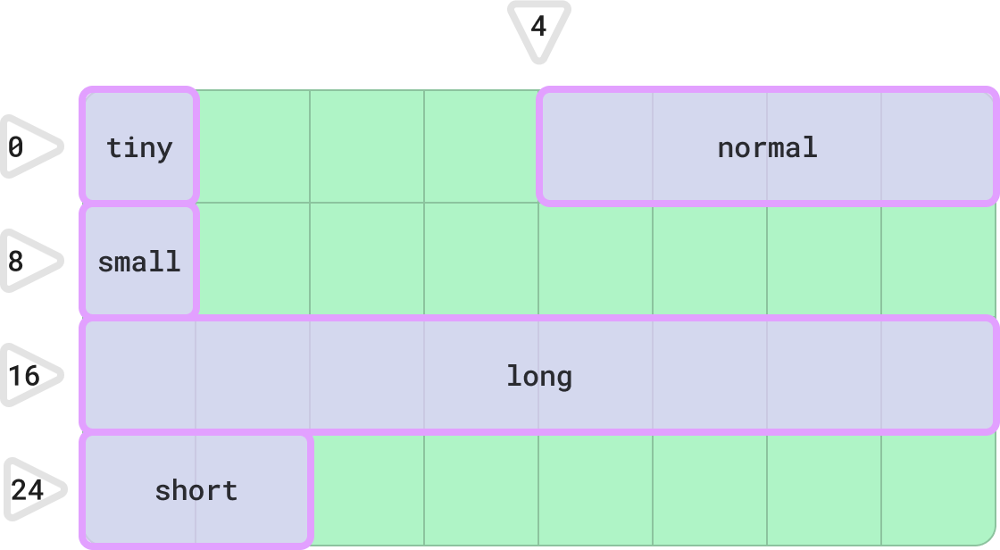

## Intro

I'm really enjoying reading [Jon Gjenset](https://x.com/jonhoo)'s [Rust for Rustaceans](https://rust-for-rustaceans.com/). I appreciated the author's decision to assume his target audience to be people who had just finished [The Book](https://doc.rust-lang.org/book/title-page.html), making it sort of an expansion or a Level II.

However, I found it light on contrasting examples, as well as images. I'm more of a visual learner, so I find them very useful to understand what's right (or wrong), or to help me create a mental model of a concept being described.

Therefore, to help me _really_ grasp the topics discussed in the book, I'm writing the following notes. I decided to share them here in case they're useful to someone else.

> ℹ️ I have written some of these notes out of my own intuition. If you find an incorrect explanation, or consider my mental model for a concept to be wrong, please [let me know](https://x.com/_0x5d)!

> ℹ️ This is a WIP. I'll add more entries as I make progress through the book and write more examples & explanations.

> ⚠️ All the base code snippets I'm quoting here are © 2022 John Gjengset. Please buy the book, it's a must-read if you're serious about learning Rust.

I'm dividing the post by chapters & sections within them. There might be missing sections, which would mean I didn't feel the need to supplement my reading with additional examples.

Anyway, enough talking. Here it is.

## Chapter 1: Foundations

### Section 1.3: Borrowing and Lifetimes

#### Generic Lifetimes

This subsection talks about how sometimes you need to specify different lifetimes for different fields in your types (making your type generic over multiple lifetimes). Here's the example presented in the book ([playground](https://play.rust-lang.org/?version=stable&mode=debug&edition=2021&gist=ad9612f66bea47604780afa0b053d5a6)).

```rust
struct StrSplit<'s, 'p> {
    document: &'s str,
    delimiter: &'p str,
}

impl<'s, 'p> Iterator for StrSplit<'s, 'p> {
    type Item = &'s str;
    fn next(&mut self) -> Option<Self::Item> {
        todo!()
    }
}

fn str_before(s: &str, c: char) -> Option<&str> {
    StrSplit {document: s, delimiter: &c.to_string()}.next()
}
```

The author then mentions that making `StrSplit` generic over a single lifetime would cause a compilation error. Indeed, if we make the change... ([playground](https://play.rust-lang.org/?version=stable&mode=debug&edition=2021&gist=2ea00b0cb451ded9f3430aca16e2eb00))

```rust
struct StrSplit<'s> {
    delimiter: &'s str,
    document: &'s str,
}

impl<'s> Iterator for StrSplit<'s> {
    // ... contents remain the same
}

fn str_before(s: &str, c: char) -> Option<&str> {
    StrSplit {document: s, delimiter: &c.to_string()}.next()
}
```

and run `cargo build`, we get the following error:

```bash
error[E0515]: cannot return value referencing temporary value
  --> src/main_wrong.rs:14:5
   |
14 |     StrSplit {document: s, delimiter: &c.to_string()}.next()
   |     ^^^^^^^^^^^^^^^^^^^^^^^^^^^^^^^^^^^-------------^^^^^^^^
   |     |                                  |
   |     |                                  temporary value created here
   |     returns a value referencing data owned by the current function
```

It becomes more evident if we mark the lifetimes using the notation used in
The Book:
```rust
                                //---------------------------+- s & c are 'a
fn str_before(s: &str, c: char) -> Option<&str> {//          |
    let delim = &c.to_string(); //--+- delim must also be 'a |
    StrSplit {                  //  |                        |
        document: s,            //  |                        |
        delimiter: delim,       //  |                        |
    }                           //  |                        |
    .next()                     //  |                        |
                                //--+ delim is dropped       |
}                               //                           |
                                //---------------------------+ s & c live on!
```

`delim`'s timeline is shorter than `s`'s and `c`'s, causing a contradiction: `'a` < `'a`.

## Chapter 2: Types
### Section 2.2: Layout

The explanation here comparing the default Rust in-memory [representation](https://doc.rust-lang.org/reference/type-layout.html#representations) vs the C-compatible one (`repr(C)`) is quite clear, but I thought a visual comparison would be helpful.

This is the example type used in the book:

```rust
#[repr(C)]
struct Foo {
    tiny: bool,
    normal: u32,
    small: u8,
    long: u64,
    short: u16,
}
```

As explained in page 21, 
> _Complex types - types that contain other types - are typically assigned the largest alignment of any type they contain._

Therefore, this is its C-compatible layout, as described in page 22 (each square is 1B):


By visualizing it as a grid, it becomes clearer that the padding is determined by the field with the type that takes up the most space, `long`.



And this would be Rust's default layout (i.e. specifying `#[repr(Rust)]`, or no `repr` attribute at all), which is 8B-aligned like the C-compatible layout, but which requires no padding between fields, reducing the total size to 16B.


#### Bonus Track: Alignment Modifiers

The book doesn't mention the [alignment modifiers](https://doc.rust-lang.org/reference/type-layout.html#the-alignment-modifiers) `align` and `packed`, which are only available for the `C` and `Rust` (default) representations, and can be used to "respectively raise or lower the alignment of structs and unions".

While reading about them, I again felt that their effects would be easier to understand and explain with a visual model.

**`packed`**

If we add `#[repr(C, packed(2))]` to the `Foo` struct, the struct will be 2B-aligned. This is what it would look like (the "grid" visual model becomes less useful here, since padding and field alignment isn't determined by a field's size):


This can be verified with the following code ([playground](https://play.rust-lang.org/?version=stable&mode=debug&edition=2021&gist=91ca1cec472a98d66443df3e2ae1f485)):

```rust
use std::mem;

#[repr(C, packed(2))]
struct Foo {
    tiny: bool,
    normal: u32,
    small: u8,
    long: u64,
    short: u16,
}

fn main() {
    assert_eq!(mem::align_of::<Foo>(), 2);
    assert_eq!(mem::size_of::<Foo>(), 18);
}
```

The layout for `repr(Rust, packed(2))` is still the same as the one before, since 16B is 2B-aligned there was no padding.

**`align`**

As mentioned above, `align` raises the alignment. If we add `#[repr(align(32))]` (default representation, 32B-aligned) to `Foo`, this is what we get:


This basically adds a 16B padding to the memory occupied by the type. Again, this can be checked with the following code ([playground](https://play.rust-lang.org/?version=stable&mode=debug&edition=2021&gist=ba2571ce2a82b426568ad34cabc6e78c)).

```rust
use std::mem;

#[repr(align(32))]
struct Foo {
    tiny: bool,
    normal: u32,
    small: u8,
    long: u64,
    short: u16,
}

fn main() {
    assert_eq!(mem::align_of::<Foo>(), 32);
    assert_eq!(mem::size_of::<Foo>(), 32);
}
```

Trying out different values for `packed` and `align` was pretty interesting. I encourage anyone learning about them to do the same. You can also check your assumptions by first creating a layout diagram like the ones above (Excel works well, no need for fancy design software), and then asserting your guesses with `align_of` and `size_of`.
