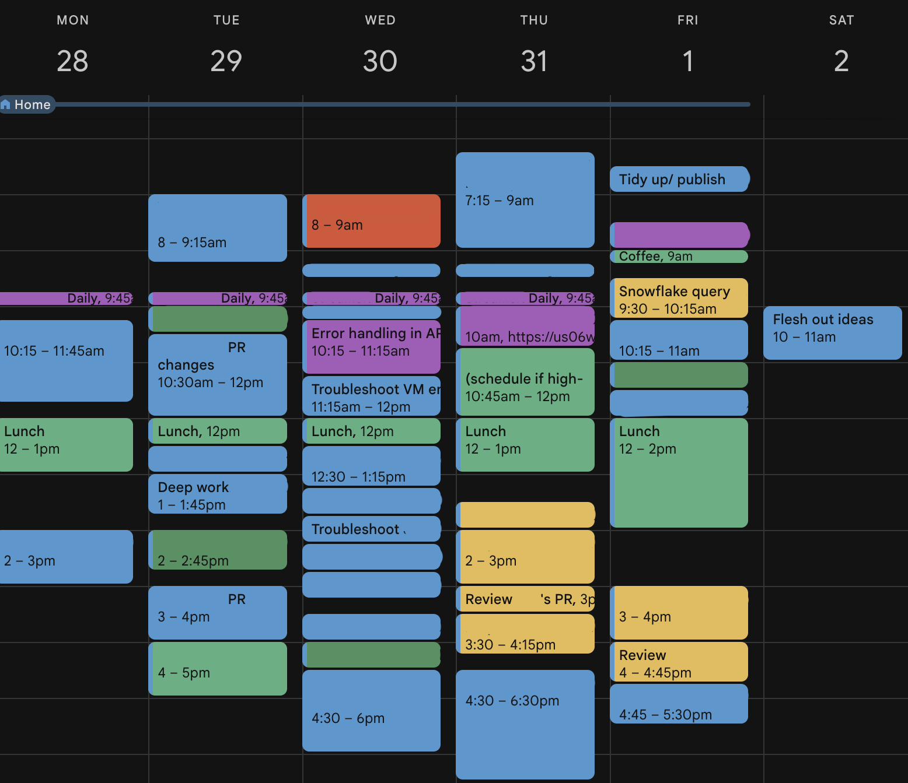
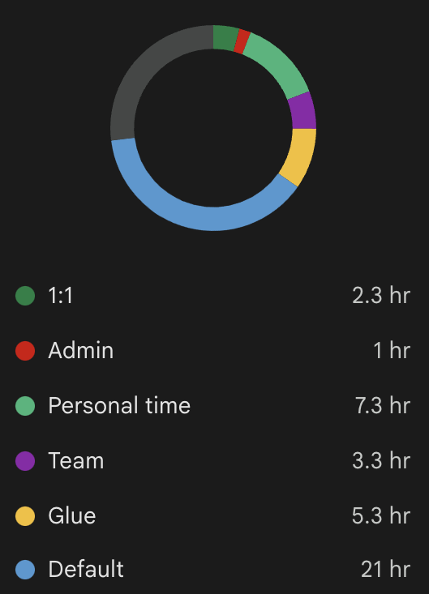

_"I've been meaning to do A"_

\- Lots of people, very often.

You've probably heard these words too, usually followed by _"...but I just can't find the time"_, or _"...but I keep forgetting"_.

I've been on both sides of this phrase, and they both feel bad.

If you're the one saying it, you probably feel frustrated. You _really_ want to do the thing, and you _really_ didn't have time to do it, and it keeps happening.

On the receiving end, it can at least be pretty awkward, and at most, also very frustrating. Generally speaking, it's usually the case that the other person _could_ make time for it. And if you care about the person you're talking to, frustration comes from the fact that the thing they want to do would be beneficial for them (exercising & learning come to mind), so you'd like them to achieve their goals.

Out of these 2, you can only change how **_you_** manage time. And you _can_ change it. We always think people do have the time, but _they_ just don't manage it well. Well, how come it applies to them and not _us_? Statistically speaking, you're just as busy as _them_.

So here's the single most useful tool I've found to stop making excuses. You only need
1. To be alive.
1. The Google calendar app.

It's a simple thing. Kind of dumb, really. But it works if you take it seriously (this is the hard part). I also think it's worth writing about because very few people I know do it.

## Schedule & log everything

That's it!

If you want to do something, schedule time to do it on your calendar app.

If you did something you hadn't scheduled, log it on your calendar app.

It takes seconds to do it. It also takes discipline, but less discipline than to remember everything you said you'd do at a specific time, and everything you did and how long it took.

### Scheduling

It's a conscious action. It also makes you think how much time you want to dedicate to the activity you're scheduling. Afterwards, it gives you visual feedback that you can't schedule something at the same time (time travel leads to paradoxes!). If you make your events visible (not necessarily public), the benefit is twofold: It communicates to other people who have access to your calendar that they shouldn't schedule something over it without checking.

You won't get to your goals if people are always inviting to meetings. This is saying no (to you and others) before you're even presented with a decision.

### Logging

Predicting accurately every single thing I do during my day, and how long I'll take doing it, is unrealistic. I can forecast that making a cup of coffee on a V60 will take me around 5 minutes, but not how long I'll take to write a document with a detailed proposal on a new architecture for a system.

I also leave open spots where coworkers can schedule meetings with me, or otherwise allow me to shuffle things around if need be.

So I just log the things I hadn't planned for by create events in the past. If something urgent comes up, like mitigating an incident or troubleshooting an issue with a customer, I'll log it too.

## Useful tips

Here are some optional things I've found to work too. I'll keep updating this if I find more.

### Add context while it's fresh

All calendar apps have a description field for events. If I'm setting time aside to watch a video, I'll add the link there. Same for reading articles. Then, when I get a reminder, I just have to follow the breadcrumbs I left for me. No extra friction or gaps to let distractions in.

### Shuffle things around

Some activities may run longer than you initially anticipated, spilling into others. That's alright. Just move the next activity to a slot where it fits, or break it down into parts.

### Be specific

I've seen a couple people do a light version of this where they just create "deep work" blocks, or an app does it for them automatically. However, deep work could mean many different tasks: working on a project, reviewing a colleague's work, reading, and so forth. Decide on a task and commit!

### Be pesimistic

I use a 1.5h default for most tasks I schedule in the future. If they take less time, then I'll see what fits in the upcoming slot. On the flip side, when I underestimate a chain of events, I end up with a fragmented calendar which can also be a source of distraction due to associated notifications.

### Leave free slots

If you block every free slot in your calendar with a generic title like "focus time", people will just learn to ignore it.

### Categorize

Here's a whole week where I was pretty thorough in scheduling & logging. Google calendar (and I bet other calendar apps do too) has an Insights feature that breaks down the time you spent in different types of activities.

If you're disciplined tagging your events with the right color, you get instant visual feedback of how you're spending your time. Time sinks also become clearer, allowing you to take corrective actions.

## But apps X & Y already do this for you

They might! You should definitely keep using them if they work for you. After using a popular app & Google calendar add-on for months, I couldn't shake the feeling that I was fighting it. The whole point of this is for me to gain control of my time. By doing it myself I am consciously making a choice to set time aside to do something, or consciously _preventing_ myself from having to make a choice - I can just block Thursday evenings to work on pet projects, removing the choice of "what to do on Thursdays" completely.

Scheduling & logging takes seconds. I'm not looking to shave seconds off my day. I'm looking to consciously make time (hours, days over months) to work towards my goals.

## The catch

This only works if you're actually doing the things you set out to do during the time you allocated for it.

If you set aside 3 hours on Saturdays to read, but spend 50% of that doomscrolling, what's the point? That's the "taking it seriously" part I mentioned in the intro. Social media has conditioned us for constant shots of dopamine, and rewiring our brains so that we chase long-term, more fulfilling goals is hard. I won't tell you how to do it, but I can tell you that if you have Twitter or Instagram still installed on your phone, you're probably not there yet.

# Time, volume & interrupts

I think the difficulty to _make time_ for goals and activities comes from 2 axioms:
- Axiom A: Time is impalpable and infinite.
- Axiom B: Attention is fickle.

**Regarding _A_**, the effect it has on our plans is that it seems we will always have time to do the things we wanna do, and the time to do them could be whenever.

It should be clear, however, that it isn't the case. We know our lives are finite, and we know that free time is limited, starting with the fact that 1/3 of of it we (should) spend sleeping.

**As for _B_**, it's pretty much provable by the fact that you're now reading this sentence, and you didn't just stick to the previous one for all eternity. Or maybe you didn't even read this far; you got bored with all these words, closed this tab and are scrolling through your Instagram feed right now.

Our focus is always changing, looking for the next shiny thing.

Therefore, we have to find ways to make these forces' effects on the way we act and think less strong. Specifically, we need to **give time _volume_ and _weight_**, and **make interrupts as rare as they can be**.

## Giving time volume & weight

Not all activities are equally exciting or valuable. Furthermore, not all activities take equally as long. These two inputs are what determine the weight and volume of an activity. In a calendar, they translate into how willing you are to move them around, and how big a portion of your day they take, respectively.

## Making interrupts as rare as can be

The hardware metaphor has become commonplace, but context switches are expensive. For most of us, it takes effort to get into a flow state, so if we're taken out it means we have to recontextualize, and then go back to the original task. Those "Now, where was I?" situations should be minimized so that you are able to make progress towards your goal.

For most of us, this means:

1. Creating a distraction-free environment, but especially

1. Disabling notifications on our devices.

I won't go into how. There are tutorials, but toggling them on is the easy part. Ceasing to chase the dopamine rush is 99% of it.

## Outro

I'm always looking to incorporate things that help me cultivate my ability to focus and become more effective. If you have more techniques which have worked for you, or have any comments on this blog, don't hesitate to write me an [email](mailto:blog@0x5d.io)!
